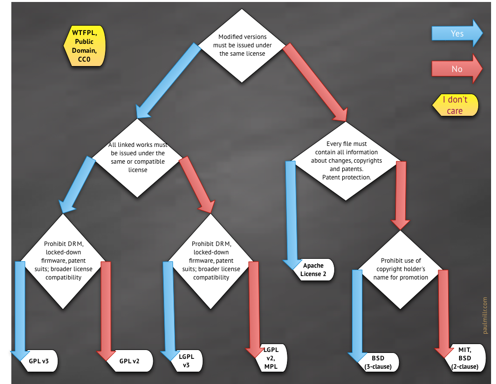

# Licences
开源证书相关信息汇总
### 主流开源协议之间有何异同？
[参考URL](https://www.zhihu.com/question/19568896)

### github 官方指导
[Choose an open source license](https://choosealicense.com/)
[中文译文](http://choosealicense.online/)

### a collection of resources for individuals, communities, and companies who want to learn how to run and contribute to an open source project.
[Web site](https://opensource.guide/)

### 中文信息集合
[开源之道](https://ocselected.org/)

[开源的法律保护](https://ocselected.org/open-source-guide/legal/)

### GNU ORG

[Various Licenses and Comments about Them](http://www.gnu.org/licenses/license-list.html)

### 长话短说

### 详细版本

作者：景略集智
链接：https://www.zhihu.com/question/19568896/answer/507675584
来源：知乎
著作权归作者所有。商业转载请联系作者获得授权，非商业转载请注明出处。

内容部分来源于[Open Source Licenses Comparison Guide](https://itsfoss.com/open-source-licenses-explained/)

开源项目的版权都有明确的归属，受到相关开源协议的约束和保护。在**GitHub上有一篇详细的《开源指南》，讲解了开源的基本法律知识和问题**。希望使用GitHub的朋友都能认真读一读这篇指南，保护自己的合法权益，也尊重他人的劳动成果：

[open source guides](https://ocselected.github.io/open-source-guide/legal/)

开源协议（Open Source License）就是一种用于计算机软件开源使用的许可证，目前世界上有多达上百种开源许可证，不过我们最常用的主流开源协议主要有**GPL、LGPL、EPL、MPL、Apache、MIT和BSD**这几种。

下面就介绍一下这些主流的开源协议，帮助大家在选择开源协议时心里能有个数。

**1.GNU General Public License (GPL)**

GPL是最受欢迎的开源许可证之一。它有好几个版本，但对于新项目，你应该考虑使用最新版GPL。

GPL支持强大的版权保护，可能是最具保护性的免费软件许可证。其背后的核心理念就是任何衍生作品，也必须在GPL下发布。具有以下特点：

- 版权约束很强
- 项目工作适合商业用途。
- 被许可方可以修改项目。
- 被许可方必须将源代码与衍生作品一起发布。
- 衍生作品必须以相同的条款发布。

**使用GPL协议的常见项目**

GPL是自由软件基金会项目的指定许可证，包括Linux系统核心的各种GNU工具在内的很多项目都采用了GPL开源协议。大型项目，尤其是商业项目往往将GPL与一个或多个其他许可证结合使用。

Inkscape（GPL v2）：

[http://wiki.inkscape.org/wiki/index.php/Frequently_asked_questions#Under_what_license_is_Inkscape_released.3F](https://link.zhihu.com/?target=http%3A//wiki.inkscape.org/wiki/index.php/Frequently_asked_questions%23Under_what_license_is_Inkscape_released.3F)

MySQL（GPL+商业许可证）：

[https://mariadb.com/kb/en/mariadb/licensing-faq/](https://link.zhihu.com/?target=https%3A//mariadb.com/kb/en/mariadb/licensing-faq/)

MariaDB（GPL v2）：

[https://mariadb.com/kb/en/library/licensing-faq/](https://link.zhihu.com/?target=https%3A//mariadb.com/kb/en/library/licensing-faq/)

**2.GNU Lesser General Public License (LGPL)**

GPL在某种意义上讲是非常严格的，它强制任何衍生作品在相同条款下以开源方式发布。程序库应当尤为关注GPL——库是大型软件的构建模块：在GPL协议下发布库，你将强制使用该库的任何应用程序也在GPL协议下发布。LGPL则可以解决这个问题。

对于程序库，自由软件基金会（FSF）区分了三种情况：

- 你的库执行了与非自由标准竞争的标准。在这种情况下，广泛采用你的库将有助于自由软件的发展。 对于这种情况，FSF建议使用非常宽松的Apache许可证（下文会讲到这种许可证）。
- 你的库执行了其他库已执行的标准。在这种情况下，完全放弃copyleft对于自由软件的发展没有任何好处。所以FSF推荐使用LGPL。
- 最后，如果你的库不与其它库或其他标准竞争，FSF建议使用GPL。

当然，FSF的建议大多是从道德上做的考虑，而在实际情况中，开发者还会有其他方面的顾虑，特别是很多时候想根据许可项目开展商业业务。此时将商业许可证考虑在内是可行的选择。

总的来看，LGPL具有以下特点：

- 版权约束较弱（受限于动态关联的程序库）
- 项目作品适合商业用途。
- 被许可方可以修改项目。
- 被许可方必须将源代码与衍生工作一起开源发布。
- 如果你修改了项目，则必须以相同的条款发布修改后的作品。
- 如果你使用项目作品，无需以相同的条款发布衍生作品。

**使用LGPL协议的常见项目**

[http://OpenOffice.org](https://link.zhihu.com/?target=http%3A//OpenOffice.org) 3 （LGPL v3）：

[https://www.openoffice.org/license.html](https://link.zhihu.com/?target=https%3A//www.openoffice.org/license.html)

CUPS （LGPL v2和GPL）：

[https://www.cups.org/doc/license.html](https://link.zhihu.com/?target=https%3A//www.cups.org/doc/license.html)

GNU Aspell （LGPLv2.1）：

[https://directory.fsf.org/wiki/Aspell#tab=Details](https://link.zhihu.com/?target=https%3A//directory.fsf.org/wiki/Aspell%23tab%3DDetails)

**3.Eclipse Public License（EPL）**

由于版权约束比LGPL弱，因此EPL许可证更加商业友好，因为它允许转授使用许可和构建由EPL和非EPL（甚至专有）许可代码组成的软件，前提是非EPL代码是“软件的单独模块”。

此外，在包括项目工作在内的商业产品引起的诉讼/损害的情况下，EPL为EPL代码贡献者提供了额外保护。它主要具有以下特点：

- 较弱的版权约束（受限于软件“模块”）
- 项目作品适合商业用途。
- 被许可方可以修改项目。
- 如果你修改了作品，则必须以相同的条款发布修改后的作品。
- 如果你使用了作品，无需以相同的条款发布衍生作品。
- 软件的商业分销商必须在因商业用途导致的诉讼/损害中保护或赔偿原始EPL贡献者。

**使用EPL协议的常见项目**

编程语言Clojure：

[https://clojure.org/community/license](https://link.zhihu.com/?target=https%3A//clojure.org/community/license)

应用服务器Jetty（EPL v1.0）：

[https://www.eclipse.org/jetty/licenses.html](https://link.zhihu.com/?target=https%3A//www.eclipse.org/jetty/licenses.html)

Java测试框架（EPL v1.0）：

[https://junit.org/junit4/license.html](https://link.zhihu.com/?target=https%3A//junit.org/junit4/license.html)

**4.Mozilla Public License (MPL)**

MPL是Mozilla基金会开发的软件所用的许可证，当然不仅仅用于这个领域。 MPL旨在成为严格许可证（如GPL）和宽松许可证（如MIT许可证）之间的折中方案。

在MPL中，“发证单位”是源文件。许可方不得限制MPL涵盖的任何文件的用户权限和访问权限。但是同一个项目也可以包含专有的非MPL许可文件。如果授予对MPL许可文件的访问权限，则可以在任何许可下发布生成的项目。

MPL具有以下特点：

- 版权约束较弱（受限于单个文件）
- 项目作品适合商业用途。
- 被许可方可以修改项目。
- 被许可方必须提供引用说明。
- 被许可方可以根据不同条款重新发布衍生作品
- 被许可方不得重新许可MPL许可的资源
- 被许可方必须将其衍生作品与MPL许可的源代码一起分发。

**使用MPL协议的常见项目**

火狐浏览器

办公套件LibreOffice（MPL v2.0）：

[https://www.libreoffice.org/about-us/licenses/](https://link.zhihu.com/?target=https%3A//www.libreoffice.org/about-us/licenses/)

2D图形引擎Cairo（MPL v1.1）：

[https://cairographics.org/](https://link.zhihu.com/?target=https%3A//cairographics.org/)

**5.Apache License 2.0 (ASL)**

ASL出现后，我们逐步进入宽松的免费许可证时代。在某些情况下，甚至FSF都建议使用Apache许可证。Apache许可证相当宽松，因为它不需要在相同的条款下分发任何衍生作品。换句话说，这是一个非版权许可证。

ASL是Apache 软件基金会项目使用的唯一许可证。广泛认为ASL对商业友好，已在该组织之外得到大量应用。在ASL下发布企业级项目并不稀奇。

Apache许可证具有以下特点：

- 非版权
- 项目作品适合商业用途。
- 被许可方可以修改项目。
- 被许可方必须提供引用说明。
- 被许可方可以根据不同条款重新分配衍生作品。
- 被许可方不必将其衍生作品和源代码一起分发。

**使用ASL协议的常见项目**

安卓（ASL v2.0，某些情况例外）：

[https://source.android.com/source/licenses.html](https://link.zhihu.com/?target=https%3A//source.android.com/source/licenses.html)

Apache Spark（ASL v2.0）：

[http://spark.apache.org/faq.html](https://link.zhihu.com/?target=http%3A//spark.apache.org/faq.html)

Spring Framework（ASL v2.0）：

[https://spring.io/projects/spring-framework](https://link.zhihu.com/?target=https%3A//spring.io/projects/spring-framework)

**6.MIT License**

MIT许可证

这是一个非常受欢迎的许可证，甚至可能是最受欢迎的。它对重复使用的限制极少，可以轻松地与其他许可证相关联，包括GPL和专有许可证。

具有以下特点：

- 非版权
- 项目作品适合商业用途。
- 被许可方可以修改项目。
- 被许可方必须提供引用说明。
- 被许可方可以根据不同条款重新发布衍生作品
- 被许可方不必将其衍生作品和源代码一起发布。

使用MIT协议的常见项目：

Node.js：

[https://nodejs.org/en/](https://link.zhihu.com/?target=https%3A//nodejs.org/en/)

Atom：

[https://atom.io/faq](https://link.zhihu.com/?target=https%3A//atom.io/faq)

AngularJS：

[https://docs.angularjs.org/misc/faq](https://link.zhihu.com/?target=https%3A//docs.angularjs.org/misc/faq)

**7.BSD许可证**

BSD许可证有三种版本：初版的4句版许可证，“修订版”3句版许可证和“简化版”2句版许可证。这三种版本都在使用理念上高度接近MIT许可证。事实上，2句版BSD许可证和MIT许可证之间的实际差异很小。

3句版和4句版BSD许可证增加了对名称重用和广告的更多要求。如果你想保护自己的产品或品牌名称，可以考虑使用这两版许可证。

BSD许可证具有以下特点：

非版权

- 项目作品适合商业用途。
- 被许可方可以修改工作。
- 被许可方必须提供引用说明。
- 被许可方可以根据不同条款重新发布衍生作品。
- 被许可方不必将其衍生作品和源代码一起发布。
- 被许可方不得使用原作者名称或商标来为衍生作品背书（3句版和4句版BSD）
- 被许可方必须在提及此项目功能或用途的所有广告材料中致谢项目原作者（4句版BSD）

**使用BSD协议的常见项目**

Django（3句版BSD）：

[https://www.djangoproject.com/foundation/faq/](https://link.zhihu.com/?target=https%3A//www.djangoproject.com/foundation/faq/)

Ruby（2句版BSD和自定义许可证）：

[https://www.ruby-lang.org/en/about/license.txt](https://link.zhihu.com/?target=https%3A//www.ruby-lang.org/en/about/license.txt)

Redis（3句版BSD）：

[https://redis.io/topics/license](https://link.zhihu.com/?target=https%3A//redis.io/topics/license)

看到这里想必大家对主流开源协议已经有了大致的了解，在维基百科上有张图更为直观的汇总了各个开源许可证在多个方面的差别：

该维基条目地址：

https://en.wikipedia.org/wiki/Comparison_of_free_and_open-source_software_licenses

[https://zh.wikipedia.org/wiki/%E8%87%AA%E7%94%B1%E5%8F%8A%E9%96%8B%E6%94%BE%E5%8E%9F%E5%A7%8B%E7%A2%BC%E8%BB%9F%E9%AB%94%E8%A8%B1%E5%8F%AF%E8%AD%89%E6%AF%94%E8%BC%83](https://zh.wikipedia.org/wiki/自由及開放原始碼軟體許可證比較)

那么**怎样为自己的项目选合适的开源协议呢？**

其他答主分享的乌克兰程序员 Paul Bagwell 制作的、阮一峰汉化的那张速查图，是个不错的参考。

此外国外IT大牛Dan Bentley制作了一张更全面也很有趣的图，有网友做了汉化：

图片翻译作者：flniu@diycode

详情查看此文：

[https://www.diycode.cc/topics/164](https://link.zhihu.com/?target=https%3A//www.diycode.cc/topics/164)

作为开源项目聚集地，GitHub也格外重视开发者所遵守的开源协议，为此专门发布了一个网站[http://ChooseALicense.com](https://link.zhihu.com/?target=http%3A//ChooseALicense.com)教大家怎么选择开源协议：

[https://choosealicense.com/](https://link.zhihu.com/?target=https%3A//choosealicense.com/)

最后，再谈谈关于开源协议的几个重要问题：

- **我能不使用任何开源协议吗？**

如果项目没有明确注明所适用的开源许可证，则应用项目作者司法管辖区的“默认”版权。换句话说，永远不要将“不用许可证”当成一种隐式授权，让他人随心所欲地使用你的项目。事实恰恰相反：即使没有明确的许可证，你，项目的作者，事实上并未放弃法律授予的任何权利。

但请记住，许可证既支配权利也支配义务。你有没有想过为什么这么多许可证文本中都有一份粗体大写的关于产品保证的免责声明，或者更常见的是没有保证？这是为了保护作品的所有者免受隐性担保或用户假设。你最不想看到的就是因为发布了开源项目而被起诉吧！

- **我能使用自定义开源协议吗？**

你能，但**最好别这么干**。

作为一种合同，许可证不能（在大多数司法管辖区）凌驾于地方法律之上。因此，在全球各地难以强制执行许可权利。一旦牵扯到官司，在法官面前为“标准”开源许可证辩护会更容易（难度要低一些）。事实上，已经出现了类似的案件。显然，使用自定义许可证这官司很难打。

此外，自定义许可证可能会与其他许可证发生冲突，从而导致你的项目在法律上不利。

- **我能使用多个开源协议吗？**

是的，可以，使用多个开源许可证并不罕见。特别是当你想根据开源项目开展商业业务时，最好是多考虑几个开源协议。

- **我后面能修改许可证吗？**

能改。版权所有者负责许可条款，只要你是唯一的贡献者，就可以轻松更改许可证。但是举一个极端的例子，如果Linus Torvald（Linux发明者）想要在不同的许可下发布Linux内核，他可能首先需要成千上万的贡献者同意该项目。这在实际情况中是不可能完成的。当然，在合理的情况下，是可以做到的。
